# ZEQP仓储管理系统

本系统是使用 [Colder.Admin.AntdVue](https://github.com/Coldairarrow/Colder.Admin.AntdVue)框架进行功能开发

## 运行环境要求

操作系统：具体可以参考 [.Net Core依赖和要求](https://docs.microsoft.com/zh-cn/dotnet/core/install/dependencies?tabs=netcore31&pivots=os-windows)

 + Windows 
  - Windows 7 SP1+
  - Windows 10 1607+
  - Windows Server 2012 R2+
 + Linux 
  - CentOS 7+
  - Debian 9+
  - Ubuntu 16.04+
 + macOS 
  - High Sierra (10.13+)

* 运行平台：.Net Core 3.1

* 数据库：MySQL 5.5 (开发是MySQL，运行可以是MSSQL/MySQL)

## 联系方式



[个人博客](https://www.giantliu.cn)

## 功能清单

+ 基本资料
 - 仓库管理
 - 巷道管理
 - 货架管理
 - 货区管理
 - 货位管理
 - 托盘类型管理
 - 托盘管理
 - 客户管理
 - 供应商管理
 - 计量单位
 - 物料类型
 - 物料管理
 - 条码类型管理
+ 仓库作业
 - 入库管理
 - 出库管理
 - 报损管理
 - 移库管理
 - 调拨管理
 - 盘点管理
+ 业务操作
 - 收货管理
 - 发货管理
+ 报表管理
 - 仓库统计
 - 库存台帐
 - 库存报表
 - 库存明细
 - 入库明细
 - 出库明细
+ 系统设置
 - 用户管理
 - 角色管理
 - 部门管理
 - 密钥管理
 - 权限管理
 - 操作日志
 - 系统日志
 - 仓库权限
 - 数据字典
 - 系统参数

## 系统界面截图

### Rest API

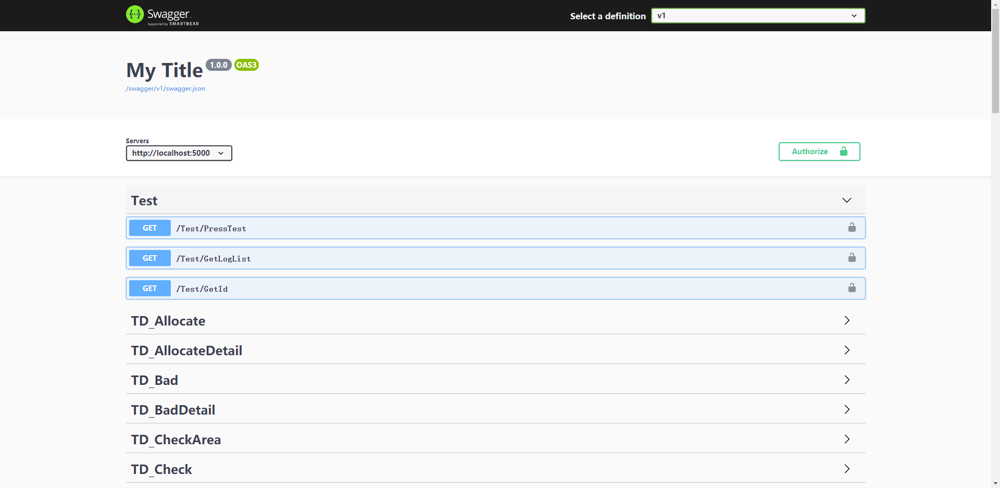

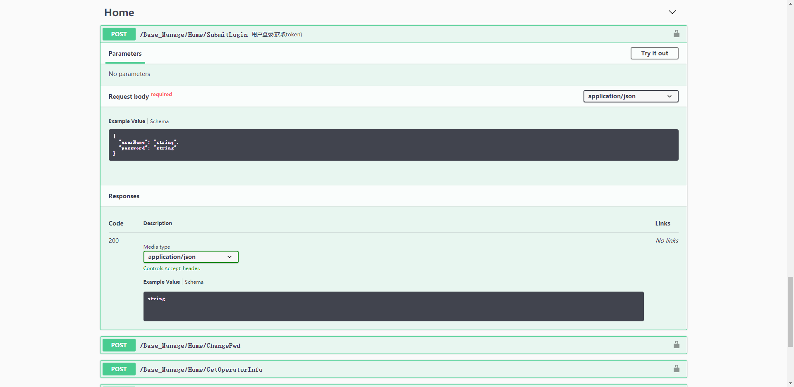

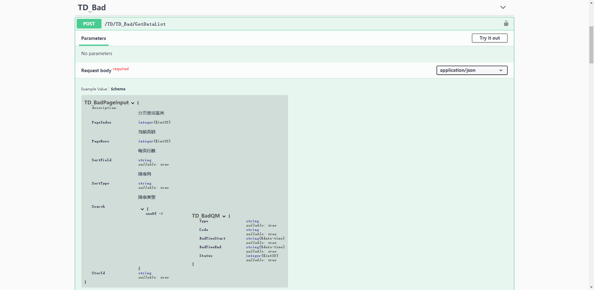

### 前端界面

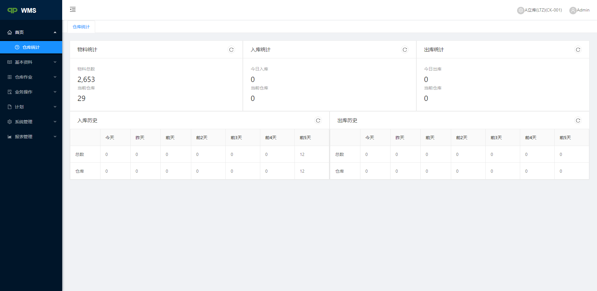

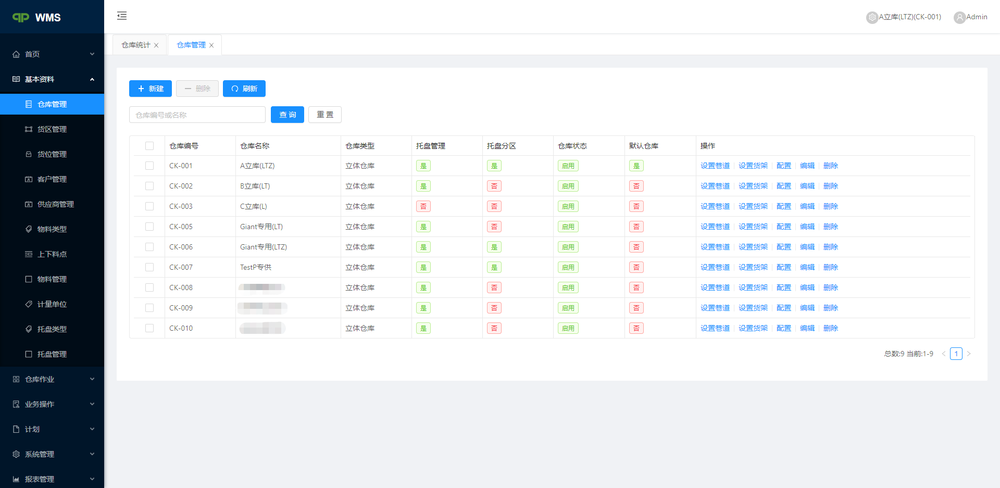

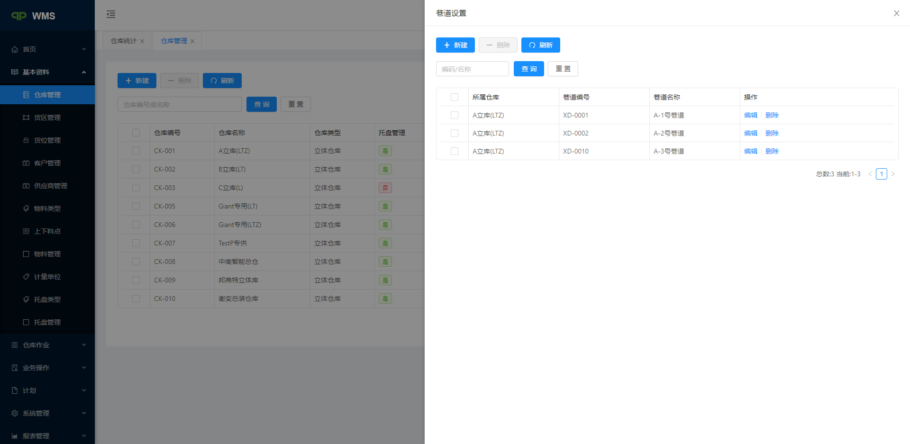

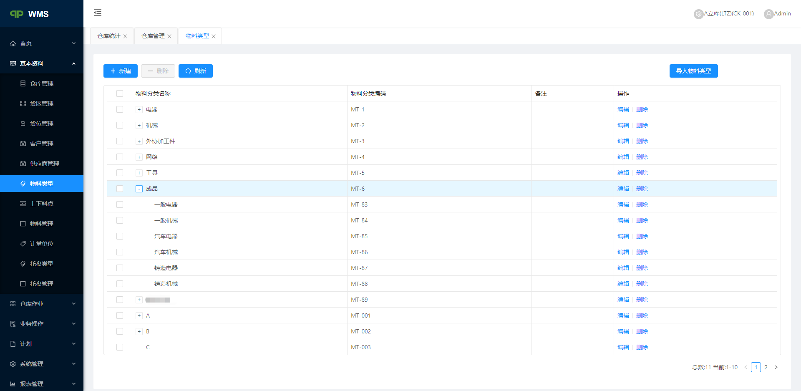

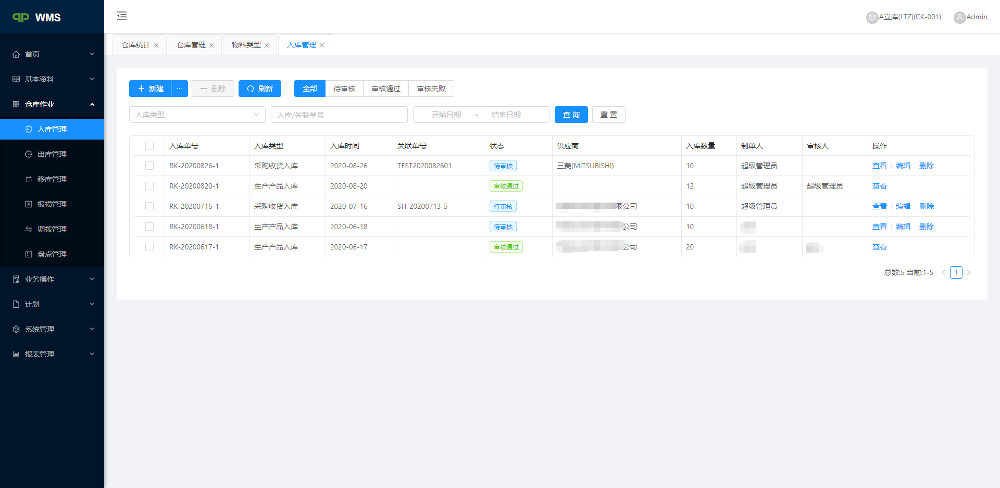

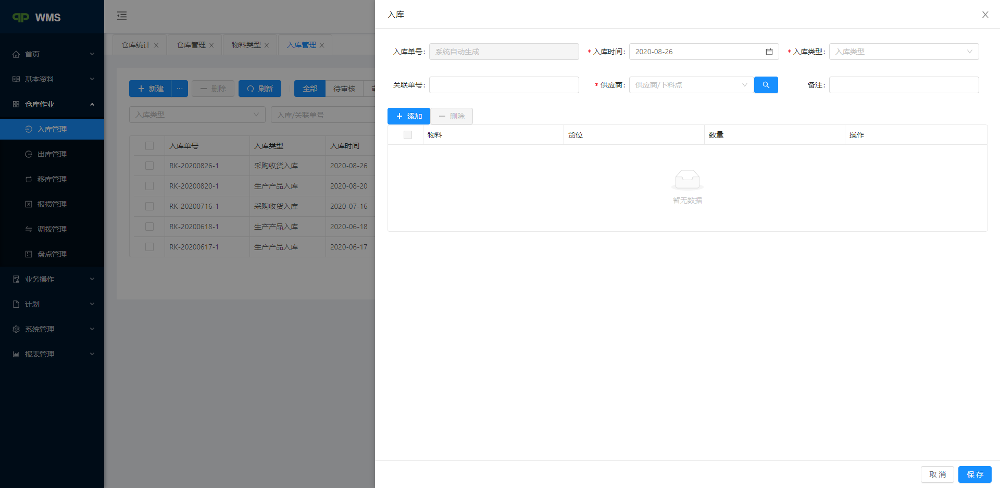

### PDA界面

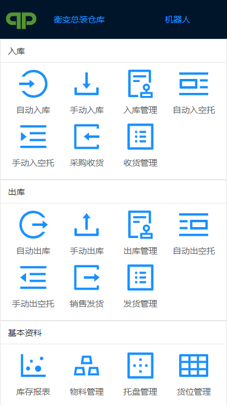

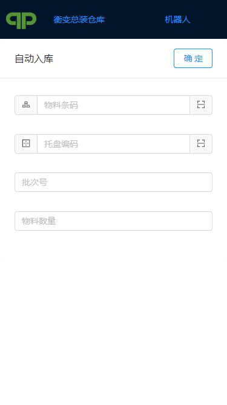

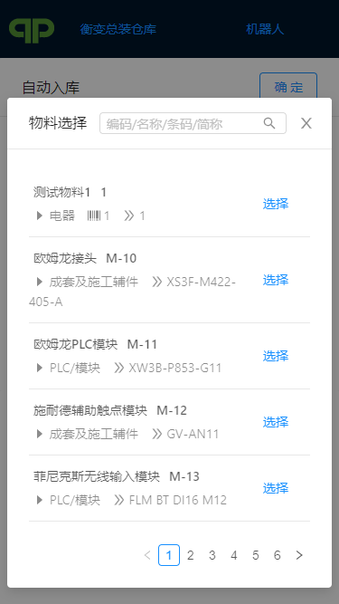

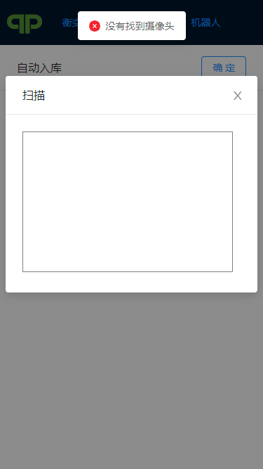

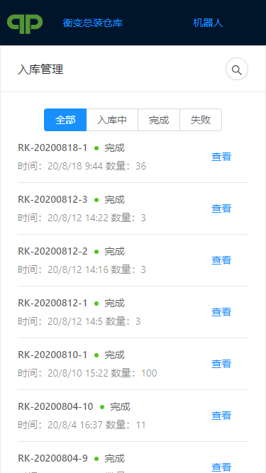

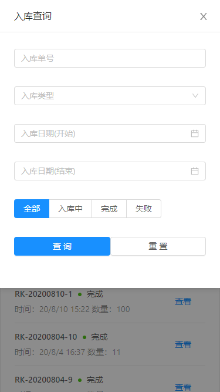

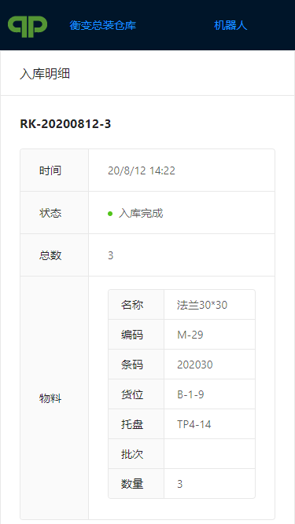
